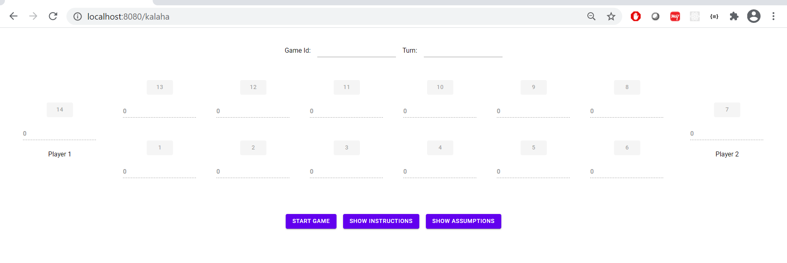

# Kalaha-board-game using spring-boot and docker!
--
This consists of two separate applications: 
- `Web module` 
    - This module is the presentation tier and handles the web aspect of the application which means user interaction with the game via browser.
- `REST API module` 
    - This module holds the business logic and mainly deals with the operations in the game.
Both the modules are dockerized which means that they are deployed in an isolated environment using docker scripts and then they are integrated with docker-compose file to form an internal network to communicate.
  This makes the modules loosely coupled, easy to scale up and down as and when required, add more type of servers in between like cache servers,load balancers.,etc. You may call it as a Microservice architecture.
      This project also assumes the following consumers:
      - WEB
      - API.
  
Other components used are:  
`Hazelcast` -

    - For distributed memory caching, with an enability to function as Load Balancer(but for future scope).It creates a cluster environment and add each server to it as a member. Number of members represent number of nodes joined.They interact via multicast/TCP/IP.
`MongoDB`

    - For storing json/bson objects

Both the modules interact using the request-response protocol i.e web requests and api serves! 

REST API : `kalaha-api`
--

#### Naming conventions:
Starting with `I - Interface`, `E - Enum`

This api has following endpoints exposed: 
- `Create Game`  
    - /kalaha/create-game; POST
    - POST body : "{\"stonesPerPit\":4,\"captureIfOppositeEmpty\":false}"
- `Fetch Game`  
    - /kalaha/fetch-game/{id}; GET
- `Delete Game`  
    - /kahala/delete-game/{gameId} ; DELETE
- `Sow stones`  
    - /kalaha/{gameId}/pits/{pitId} ; PUT

`Swagger` - Using Swagger, you can view the API specifications accessed at http://localhost:8011/v2/api-docs

WEB : `kalaha-web`
--

This module is the interface between User and kalaha-api. This uses Vaadin - Java based UI web framework.

## Running Instructions:

- Make sure you have :
    - jdk 8 | jdk1.8.0_121 or above installed.
    - maven installed
    - It needs Docker as well. So please download docker community version. If you're using Windows - please install  ["Docker for Windows"](https://docs.docker.com/docker-for-windows/install/)
- Once installed - go to the root directory of the project and build :
    - using `mvn clean install`
    - Get terminal on the same directory where root `pom.xml` and `docker-compose.yml` is present, fire below command : 
    - `docker-compose -f docker-compose.yml build`
-     mongodb uses an image, skipping
      hazelcast uses an image, skipping
      Building kalaha-web
      Step 1/5 : FROM openjdk:8-jre-alpine
      ---> f7a292bbb70c
      Step 2/5 : COPY target/kalaha-web-0.0.1-SNAPSHOT.war .
      ---> 5804b184f8b8
      Step 3/5 : EXPOSE $PORT
      ---> Running in ea2a1f8a7ed6
      Removing intermediate container ea2a1f8a7ed6
      ---> d03409e10842
      Step 4/5 : EXPOSE $DEBUG_PORT
      ---> Running in ec3ada7562a1
      Removing intermediate container ec3ada7562a1
      ---> 23624ffcef86
      Step 5/5 : CMD /usr/bin/java -Dlogging.path=/log/ -DLOG_LEVEL=DEBUG -Xdebug -agentlib:jdwp=transport=dt_socket,server=y,suspend=n,address=8013 -Xmx400m -Xms400m -jar kalaha-web-0.0.1-SNAPSHOT.war
      ---> Running in d142721566e5
      Removing intermediate container d142721566e5
      ---> 731efb7c8350
      Successfully built 731efb7c8350
      Successfully tagged kalaha-board-game_kalaha-web:latest
      Building kalaha-api
      Step 1/5 : FROM openjdk:8-jre-alpine
      ---> f7a292bbb70c
      Step 2/5 : COPY target/kalaha-api-0.0.1-SNAPSHOT.jar .
      ---> 3251cf9582a0
      Step 3/5 : EXPOSE $PORT
      ---> Running in 030159ff7d99
      Removing intermediate container 030159ff7d99
      ---> 02ad6c3daa56
      Step 4/5 : EXPOSE $DEBUG_PORT
      ---> Running in d353ce80e89a
      Removing intermediate container d353ce80e89a
      ---> a2270cb06002
      Step 5/5 : CMD /usr/bin/java -Dlogging.path=/log/ -DLOG_LEVEL=DEBUG -Xdebug -agentlib:jdwp=transport=dt_socket,server=y,suspend=n,address=8012 -Xmx400m -Xms400m -jar kalaha-api-0.0.1-SNAPSHOT.jar
      ---> Running in 939a64c23c47
      Removing intermediate container 939a64c23c47
      ---> ab9008cd68b9
      Successfully built ab9008cd68b9
      Successfully tagged kalaha-board-game_kalaha-api:latest
    - Other commands :   
        -`docker-compose -f docker-compose.yml up` ,
        -`docker-compose -f docker-compose.yml down`
    

### Other Considerations: 
Please make sure no servers are running as this applications uses below ports :   
        - `8011,8012: kalaha-api` , `8012,8013: kalaha-web` , `27017:mongodb` , `5701:Hazelcast` , `8080:tomcat`  
        - `setings.xml` - contains no proxy or anything, example:
          

    <settings xmlns="http://maven.apache.org/SETTINGS/1.0.0"  xmlns:xsi="http://www.w3.org/2001/XMLSchema-instance"  xsi:schemaLocation="http://maven.apache.org/SETTINGS/1.0.0                      http://maven.apache.org/xsd/settings-1.0.0.xsd">
	<localRepository/>
	<interactiveMode/>
	<usePluginRegistry/>
	<offline/>
	<pluginGroups/>
	<proxies>
    </proxies>
	<servers>
    </servers>
	<mirrors>
	</mirrors>
	<profiles/>
	<activeProfiles/>
    </settings>

* Once docker containers are up : 
  - `docker container ls`, `docker images -a`, `docker network ls`, `docker volume ls`
  - Go to `http://localhost:8080/kalaha`
#Snapshots:

New Page: 

Show Instructions:

Show Assumptions:

User Options while starting game:

Game Moving Stone Operation:

Game End: 

Swagger: 

# Getting Started

### Reference Documentation
For further reference, please consider the following sections:

* [Official Apache Maven documentation](https://maven.apache.org/guides/index.html)
* [Spring Boot Maven Plugin Reference Guide](https://docs.spring.io/spring-boot/docs/2.4.2/maven-plugin/reference/html/)
* [Create an OCI image](https://docs.spring.io/spring-boot/docs/2.4.2/maven-plugin/reference/html/#build-image)
* [Spring Boot DevTools](https://docs.spring.io/spring-boot/docs/2.4.2/reference/htmlsingle/#using-boot-devtools)
* [Spring Configuration Processor](https://docs.spring.io/spring-boot/docs/2.4.2/reference/htmlsingle/#configuration-metadata-annotation-processor)
* [Spring Web](https://docs.spring.io/spring-boot/docs/2.4.2/reference/htmlsingle/#boot-features-developing-web-applications)
* [Vaadin](https://vaadin.com/spring)

### Guides
The following guides illustrate how to use some features concretely:

* [Building a RESTful Web Service](https://spring.io/guides/gs/rest-service/)
* [Serving Web Content with Spring MVC](https://spring.io/guides/gs/serving-web-content/)
* [Building REST services with Spring](https://spring.io/guides/tutorials/bookmarks/)
* [Creating CRUD UI with Vaadin](https://spring.io/guides/gs/crud-with-vaadin/)
